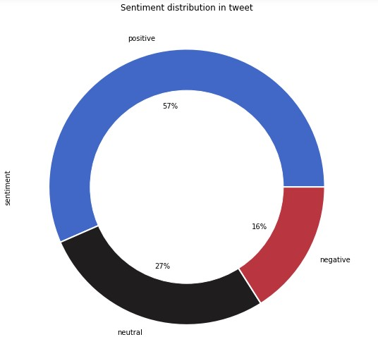
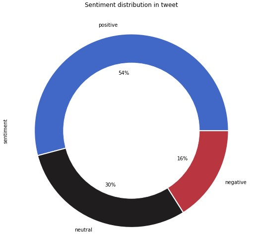
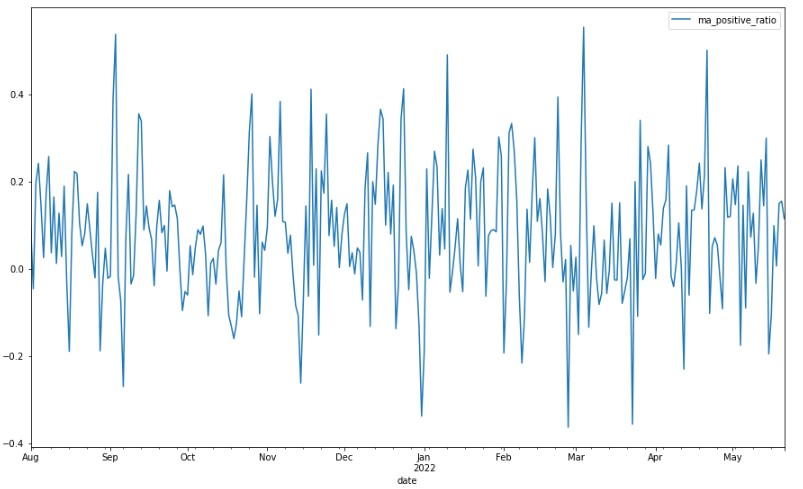
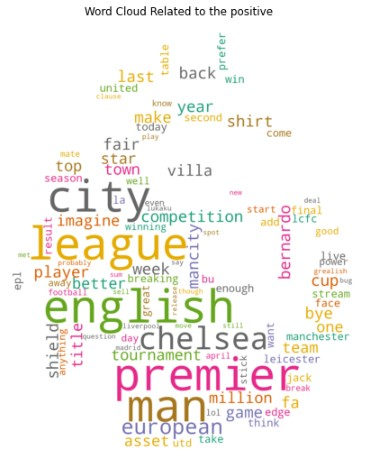
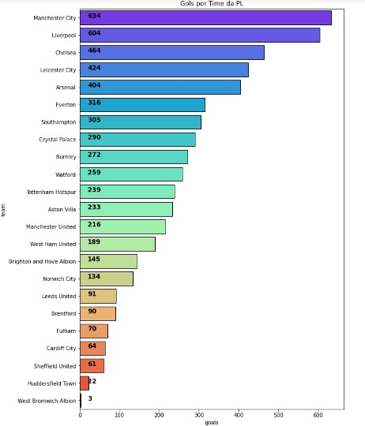
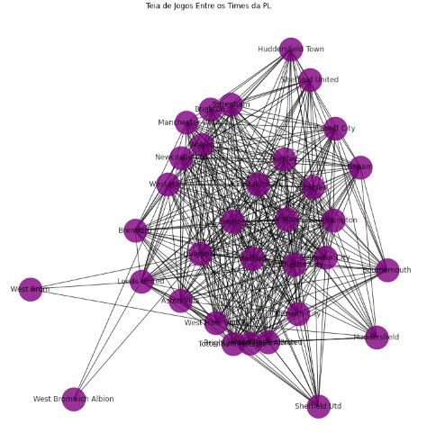
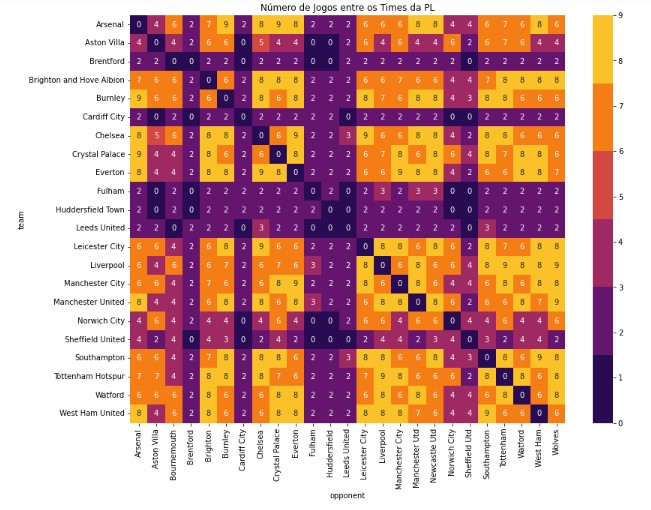
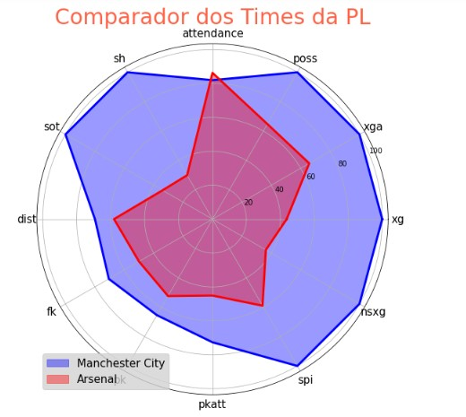

# Forecasting Model of Premier League Matches Results

## General Objective
This repository was created with the aim of facilitating collaboration among project members and presenting results to third parties. In this project, we built a Machine Learning model to predict the outcomes of Premier League games. We used the Python language to develop the Random Forest model. This work was done by Ewerton Neves, Fernando Rosario, and Gustavo Oliveira under the supervision of Gustavo Sampaio.

## Databases
Our data come from three sources:
   1. For the tweets related to PL teams, we use the Twitter module of snscrape, a library for scraping into social medias;
   2. For matches informations, we collect the data from [FBREF](https://fbref.com/en/), using a common request method;
   3. And, to collect SPI and NSXG indexes, we resort to the scraping technique that makes use of the web driver to access the information present in sites built in java script language. The referred web site is [FiveThirtyEight](https://fivethirtyeight.com/).
At the end of this step, we storege our dataframes in csv files and professionally into SQL server.
## Data Cleaning
For data manipulation, our main libraries was `pandas` and `numpy`, where we adapted the databases for visualization and estimation purposes.

## Data Visualization
In this step the main libraries used were `matplotlib.pyplot` and `seaborn`. Below we present the respectives visualizations generated:

## Model
To train and test our model, we use the Random Forest Classificatier method, loaded from sklearn library. As our best result, we get a 67.90% of accuracy level.